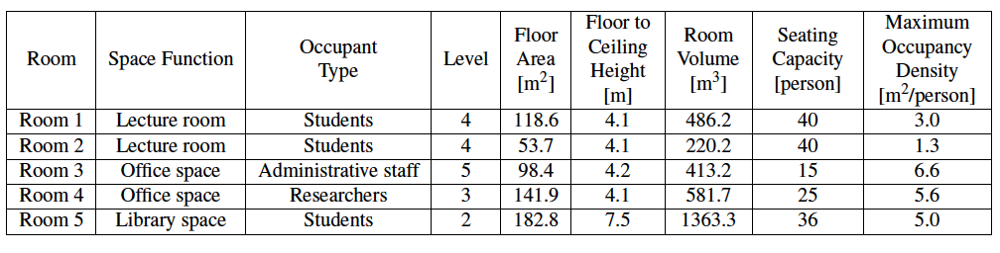
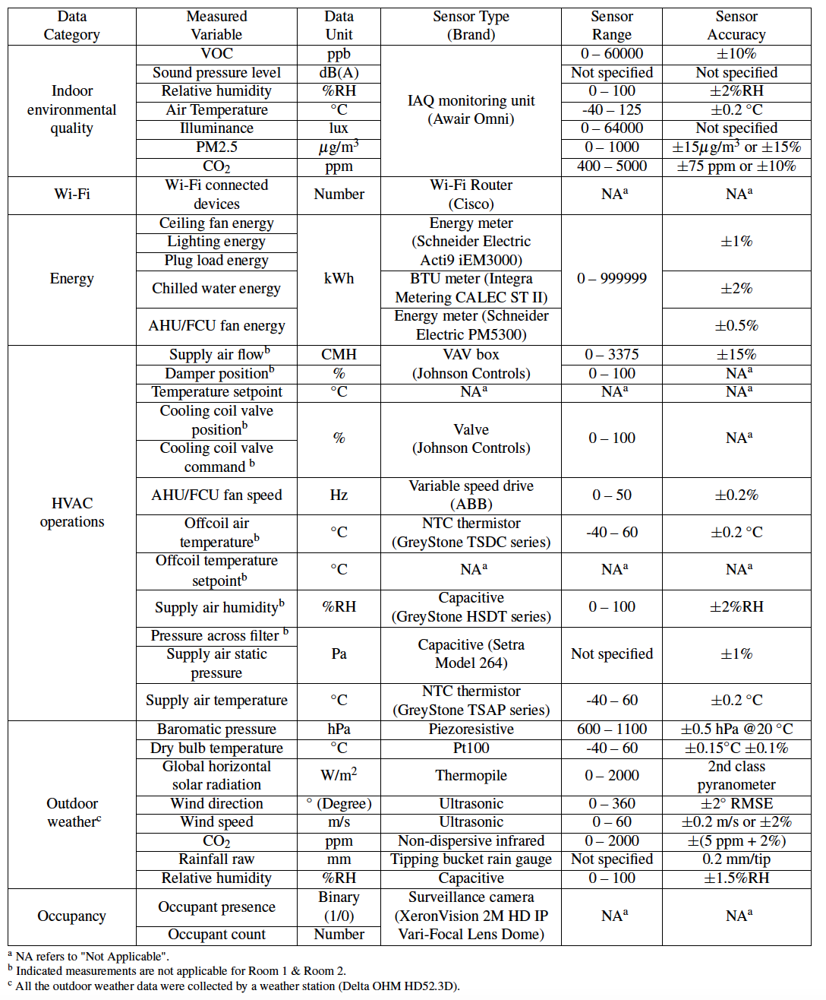

## General Information

This repository contains the data files, published manuscript and relevant analysis code for **ROBOD**, Room-level Occupancy and Building Operation Dataset.

**ROBOD** is a comprehensive dataset consisting of indoor environmental conditions, Wi-Fi connected devices, energy consumption of end uses (i.e., HVAC, lighting, plug loads and fans), HVAC operations, and outdoor weather conditions collected through various heterogeneous sensors together with the ground truth occupant presence and count information for five rooms located in a university environment. The five rooms include two different-sized lecture rooms, an office space for administrative staff, an office space for researchers, and a library space accessible to all students. A total of 181 days of data was collected from all five rooms at a sampling resolution of 5 minutes.

This dataset can be used for benchmarking and supporting data-driven approaches in the field of occupancy prediction and occupant behaviour modelling, building simulation and control, energy forecasting and various building analytics.

If you are interested in using this dataset, please cite our following paper:

Tekler, Z.D., Ono, E., Peng, Y. et al. ROBOD, room-level occupancy and building operation dataset. Build. Simul. (2022).
https://doi.org/10.1007/s12273-022-0925-9

## Data Format
Data collection period: 2021–09-07 00:00 to 2021-12-23 23:55

Each data measurement contains the timestamp information corresponding to the time when the data measurement was recorded and followed the date-time format: YYYY-MM-DD HH:MM +08:00. 
The last component (i.e., +08:00) indicates a UTC offset of +8 hours as the data collection was conducted in the tropical island of Singapore. 
All data measurements followed a sampling interval of 5 minutes.
In total, 181 days of data was collected from the School of Design and Environment 4 (SDE4) building located at the National University of Singapore.

Each folder in the existing version of the dataset is named based on the following format: combined_Room\<Room Number\>.csv

| File               | Description                                                       |
|--------------------|-------------------------------------------------------------------|
| combined_Room1.csv | All data categories combined for Room 1 (Lecture Room) - 29 days  |
| combined_Room2.csv | All data categories combined for Room 2 (Lecture Room) - 29 days  |
| combined_Room3.csv | All data categories combined for Room 3 (Office Space) - 29 days  |
| combined_Room4.csv | All data categories combined for Room 4 (Office Space) - 47 days  |
| combined_Room5.csv | All data categories combined for Room 5 (Library Space) - 47 days |

## Room Description

## Data Categories Description

